# Supplementary Material for IEEE MMSP 2024
Supplementary material for IEEE MMSP 2024
**A Sharpness Based Loss Function for Removing Out-of-Focus Blur** 
Authors:<samp>{aurangau, ramsookd, anil.kokaram}@tcd.ie</samp>

## Abstract
The advances in the field of image deblurring can
be attributed to the adoption of $l_p$, ($p$ = 1,2) as loss functions in
Deep Neural Network (DNN) based architectures. These losses,
albeit simple, do not capture the perceptual quality markers of
an image, such as sharpness. In this work, we propose a novel
method of utilizing a no-reference sharpness metric $Q$ introduced
by Zhu and Milanfar for removing out-of-focus blur. We also
introduce a dataset comprising of real-world out-of-focus images
for assessing and benchmarking restoration models. Our method
shows a 7.5% increase in the perceptual quality as compared to
a standard model trained on the $l_p$ norm as a loss

## Network Architecture
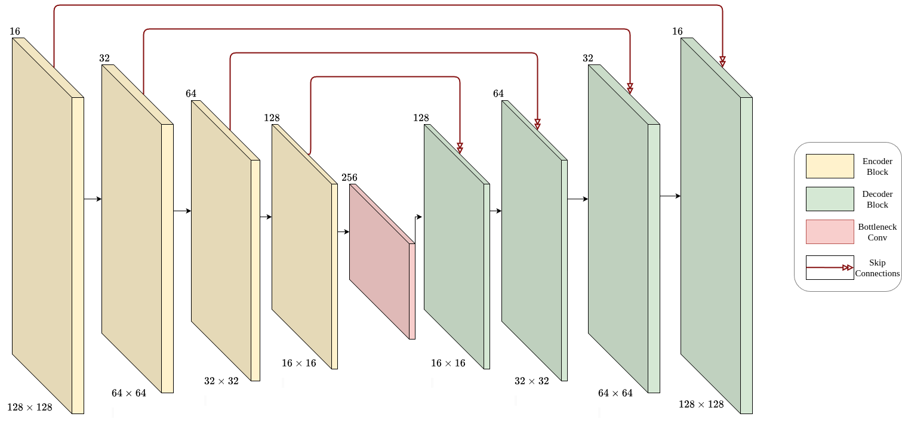
| --- |
| Network Architecture |

## Dataset
Our dataset consists of 305 5K (5796 x 3870) images. Each image has three blurry counterparts labelled as low blur, medium blur and high blur.
As the dataset is approximately 240 GB of raw images (.cr format), interested parties are encouraged to contact the first author mentioned above. We are in the process of hosting the dataset on a dedicated server.
Example crops of images from the dataset are given below:

|  | 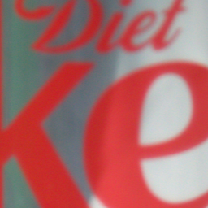 |   | 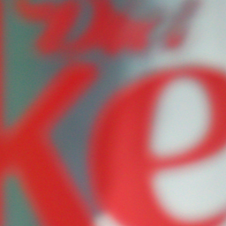 |
| --- | --- | --- | --- |

| 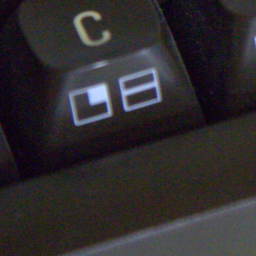 | 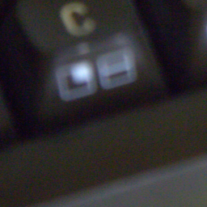 | 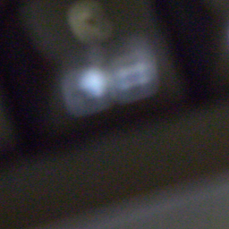 | 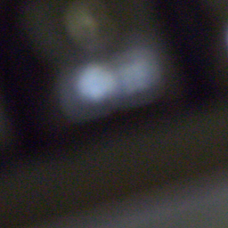 |
| --- | --- | --- | --- |

| 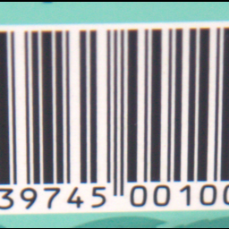 | 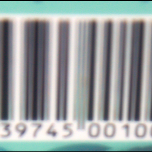 | 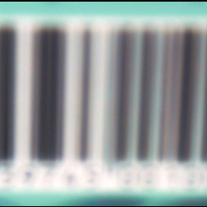 | 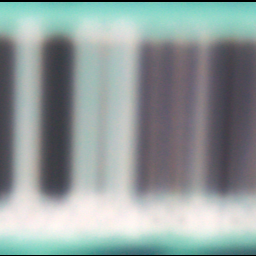 |
| --- | --- | --- | --- |
| Original Image | Low Blur Image | Medium Blur Image | High Blur Image |

## Results
We test our proposed method on synthetically degraded (blurred) imagees and real-world out-of-focus images (proposed above)
### Synthetically Blurred Dataset
For synthetically blurred datasets, we use two degradation models -  
* Blur of size 5 $\times$ 5 with 0 noise.
* Blur of size 5 $\times$ 5 with 0.3 variance noise.

We also investigate the effect of weighting coefficient $\beta$ on the sharpness of an image
### Effect of Weighting Coefficient $\beta$ on Sharpness
| $\beta$ | PSNR (dB) | SSIM | $Q$ | LPIPS
| --- | --- | --- | --- | --- |
| **0** | **35.069** | **0.944** | **0.153** | **0.127**
| 0.001 | 35.102 | 0.945 | 0.152 | 0.117
| 0.01 | 35.101 | 0.945 | 0.154 | 0.117 
| 0.05 | 34.844 | 0.945 | 0.166 | 0.122
| 0.1 | 33.641 | 0.940 | 0.183 | 0.127

### Visual Comparison 
|  |  |  |
| --- | --- | --- |
| Original Image | Blurry Image | Restormer [4] |

|  |  |  |
| --- | --- | --- |
| IFAN [3] | NBDNet [5] | Landweber [6] |

|  |  |  |
| --- | --- | --- |
| NA Landweber | PC Landweber | Ours |

### Average Blur Images

### Blurry and Noisy Images

## Real-World Out-of-Focus Dataset

## Code
The Tensorflow Implementation of our model can be found in this repository.

## References
