# Supplementary Material for IEEE MMSP 2024
Supplementary material for IEEE MMSP 2024
**A Sharpness Based Loss Function for Removing Out-of-Focus Blur** 
Authors:<samp>{aurangau, ramsookd, anil.kokaram}@tcd.ie</samp>

## Abstract
The success of modern Deep Neural Network (DNN)
approaches can be attributed to the use of complex optimization
criteria beyond standard losses such as mean absolute error
(MAE) or mean squared error (MSE). In this work, we propose
a novel method of utilising a no-reference sharpness metric $Q$
introduced by Zhu and Milanfar for removing out-of-focus blur
from images. We also introduce a novel dataset of real–world out-
of-focus images for assessing restoration models. Our fine-tuned
method produces images with a 7.5% increase in perceptual
quality (LPIPS) as compared to a standard model trained only on
MAE. Furthermore, we observe a 6.7% increase in $Q$ (reflecting
sharper restorations) and 7.25% increase in PSNR over most
state-of-the-art (SOTA) methods

## Network Architecture

| --- |
| Network Architecture |

## Dataset
Our dataset consists of 305 5K (5796 x 3870) images. Each image has three blurry counterparts labelled as low blur, medium blur and high blur.
As the dataset is approximately 240 GB of raw images (.cr format), interested parties are encouraged to contact the first author mentioned above. We are in the process of hosting the dataset on a dedicated server.
Example crops of images from the dataset are given below:

|  |  |   |  |
| --- | --- | --- | --- |

|  |  |  |  |
| --- | --- | --- | --- |

|  |  |  |  |
| --- | --- | --- | --- |
| Original Image | Low Blur Image | Medium Blur Image | High Blur Image |

## Results
We test our proposed method on synthetically degraded (blurred) imagees and real-world out-of-focus images (proposed above)
### Synthetically Blurred Dataset
For synthetically blurred datasets, we use two degradation models -  
* Blur of size 5 $\times$ 5 with 0 noise.
* Blur of size 5 $\times$ 5 with 0.3 variance noise.

We also investigate the effect of weighting coefficient $\beta$ on the sharpness of an image
### Effect of Weighting Coefficient $\beta$ on Sharpness
| $\beta$ | PSNR (dB) | SSIM | $Q$ | LPIPS
| --- | --- | --- | --- | --- |
| **0** | **35.069** | **0.944** | **0.153** | **0.127**
| 0.001 | 35.102 | 0.945 | 0.152 | 0.117
| 0.01 | 35.101 | 0.945 | 0.154 | 0.117 
| 0.05 | 34.844 | 0.945 | 0.166 | 0.122
| 0.1 | 33.641 | 0.940 | 0.183 | 0.127

### Visual Comparison of Varying $\beta$

| 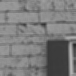|  |  | 
| --- | --- | --- |
| Blurry Image | $\beta$ = 0 | $\beta$ = 0.001 |

| 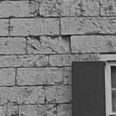 |  |  |
| --- | --- | --- |
| $\beta$ = 0.01 | $\beta$ = 0.05 | $\beta$ = 0.1 |

### Average Blur Images

| 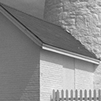 |  | 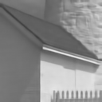 |  |
| --- | --- | --- | --- |
| Original Image | Blurry Image | DDNet [1] | XY-Deblur [2] |

|  |  |  |  |
| --- | --- | --- | --- |
| aL [3] | mLM | mRL | RED-SDM [4] |

|  | 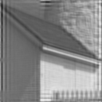 |  |  |
| --- | --- | --- | --- |
| RED-FP | Wiener Filter | Ours (w/o. FT) | Ours (w. FT) |

### Tabular Comparison
| Algorithm | PSNR (dB) | SSIM | Q | LPIPS | Time (s)
| --- | --- | --- | --- | --- | --- |
| DDNet | 29.559 | 0.842 | 0.130 | 0.271 | 0.019 | 
| XY-Deblur | 38.288 | 0.970 | 0.147 | 0.071 | 0.019 |
| aL | 29.362 | 0.882 | 0.136 | 0.229 | 0.009 |  
| mLM | 37.282 | 0.971 | 0.135 | 0.059 | 0.003 | 
| mRL | 29.658 | 0.891 | 0.134 | 0.212 | 0.012 | 
| RED-FP | 33.137 | 0.911 | 0.154 | 0.181 | 47.800 |  
| **Ours (w/o. FT)**| **34.875** | **0.946** | **0.149** | **0.116** | **0.052** | 
| **Ours (w. FT)**| **34.890** | **0.947** | **0.150** | **0.107** | **0.063** | 

### Blurry and Noisy Images

| | 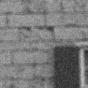 | 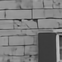 |  |
| --- | --- | --- | --- |

| | 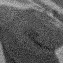 |  | 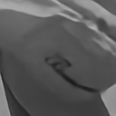 |
| --- | --- | --- | --- |

| 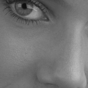| 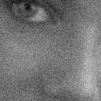 | 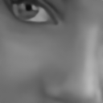 | 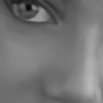 |
| --- | --- | --- | --- |

| |  | 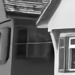 | 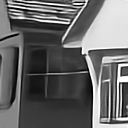 |
| --- | --- | --- | --- |

| 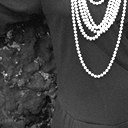|  |  |  |
| --- | --- | --- | --- |

| | 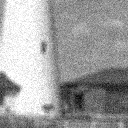 | 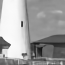 |  |
| --- | --- | --- | --- |
| Original Image | Degraded Image | W/o. Fine-Tuning | W. Fine-Tuning | 

## Real-World Out-of-Focus Dataset

### Fine-Tuning Comparison

| 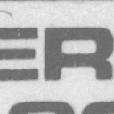| 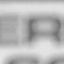 |  | 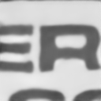 |
| --- | --- | --- | --- |

| 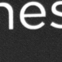| 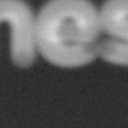 |  | 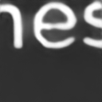 |
| --- | --- | --- | --- |
| Original Image | Blurry Image | W/o. Fine-Tuning | W. Fine-Tuning |

### Comparison with other methods

|  | 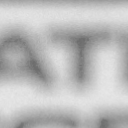 | 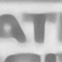 | 
| --- | --- | --- |
| Original Image | Blurry Image | Restormer [5] |

| 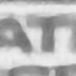 | 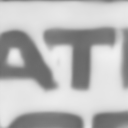 | 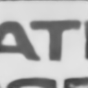 |
| --- | --- | --- |
| IFAN [6] | XY-Deblur | Ours (W. Fine-Tuning) |

### Tabular Comparison
| Algorithm | PSNR (dB) | SSIM | Q | LPIPS | Time (s)
| --- | --- | --- | --- | --- | --- |
| XY-Deblur | 28.131 | 0.784 | 0.082 | 0.668 | 0.012 |
| IFAN | 23.728 | 0.668 | 0.0.44 | 0.408 | 0.022 |  
| Restormer | 22.594 | 0.650 | 0.042 | 0.418 | 0.066 | 
| **Ours (w/o. FT)**| **28.788** | **0.792** | **0.079** | **0.450** | **0.040** | 
| **Ours (w. FT)**| **28.728** | **0.792** | **0.084** | **0.447** | **0.038** | 

## Code
The Tensorflow Implementation of our model can be found in this add link in this [repository](https://github.com/aurangau/QSharpNet).

## References
[1] Santiago López-Tapia, Javier Mateos, Rafael Molina, and Aggelos Katsaggelos, “Deep robust image restoration using the moore-penrose blur inverse,” in 2023 IEEE International Conference on Image Processing (ICIP). IEEE, 2023, pp. 775–779.

[2] Seo-Won Ji, Jeongmin Lee, Seung-Wook Kim, Jun-Pyo Hong, Seung-Jin Baek, Seung-Won Jung, and Sung-Jea Ko, “Xydeblur: Divide and conquer for single image deblurring,” in Proceedings of the IEEE/CVF conference on computer vision and pattern recognition, 2022, pp. 17421–17430.

[3] Alexander G Belyaev and Pierre-Alain Fayolle, “Black-box image deblurring and defiltering,” Signal Processing: Image Communication, vol. 108, pp. 116833, 2022.

[4] Yaniv Romano, Michael Elad, and Peyman Milanfar, “The little engine that could: Regularization by denoising (red),” SIAM Journal on Imaging Sciences, vol. 10, no. 4, pp. 1804–1844, 2017.

[5] Syed Waqas Zamir, Aditya Arora, Salman Khan, Munawar Hayat, Fahad Shahbaz Khan, and Ming-Hsuan Yang, “Restormer: Efficient transformer for high-resolution image restoration,” in Proceedings of the IEEE/CVF conference on computer vision and pattern recognition, 2022, pp. 5728–5739.

[6] Junyong Lee, Hyeongseok Son, Jaesung Rim, Sunghyun Cho, and Seungyong Lee, “Iterative filter adaptive network for single image defocus deblurring,” in Proceedings of the IEEE/CVF conference on computer vision and pattern recognition, 2021, pp. 2034–2042.

